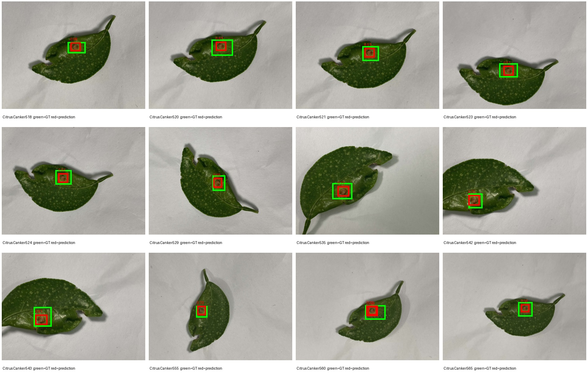
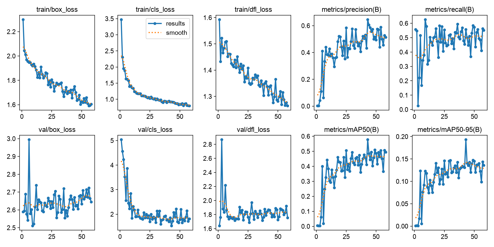
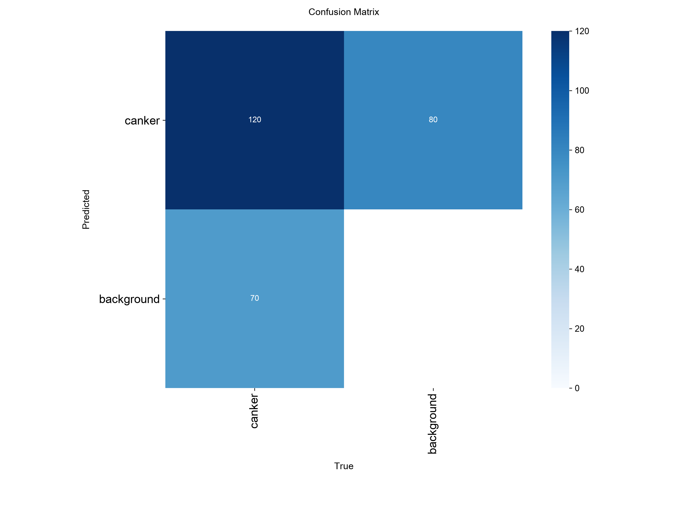
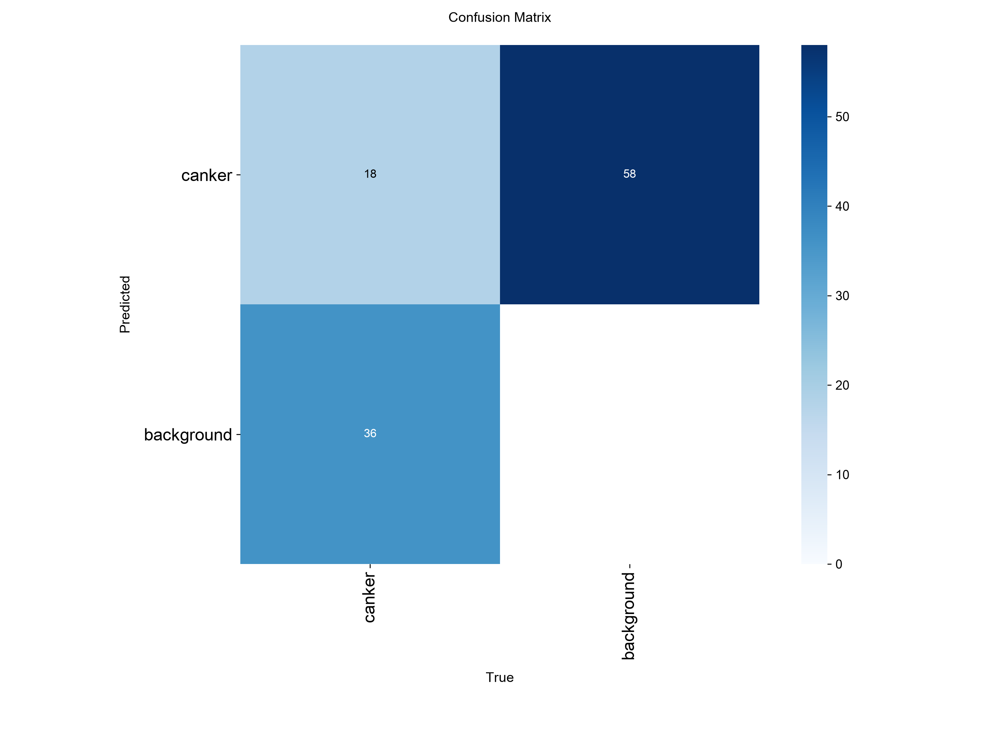

# Citrus Canker Detection with YOLO / 基于 YOLO 的柑橘溃疡病斑检测

[中文](#中文说明) | [English](#english)

## 中文说明

### 项目简介

本项目使用 Ultralytics YOLO11 检测甜橙叶片上的柑橘溃疡病斑，面向人工智能通识课算法实践。当前任务为单类别目标检测：

- 类别 `0`：`canker`（柑橘溃疡病斑）
- 基础模型：YOLO11n
- 输入：甜橙叶片图片
- 输出：病斑位置、类别与置信度

### 数据集

当前数据集包含 663 张图片和 906 个标注框：

| 集合 | 图片数 | 标注框数 | 用途 |
| --- | ---: | ---: | --- |
| train | 468 | 662 | 模型训练 |
| val | 117 | 190 | 模型选择与调参 |
| test | 78 | 54 | 阶段性诊断（已参与错误分析） |

数据不是按单张图片随机拆分，而是按物理叶片分组：同一片叶子的旋转、距离和角度变化只会出现在一个集合中，以减少数据泄漏。train 中有 52 张空标签负样本，val 中有 20 张，test 中有 27 张。train 和 val 新增负样本分别来自健康叶和 9 种其他柑橘病虫害，来源清单见 `dataset/manifests/hard_negatives_2026-09-02.csv` 与 `dataset/manifests/hard_negatives_val_2026-09-02.csv`。

数据来源于 Emon、Ahad 与 Rabbany 发布的 *Multi-format open-source sweet orange leaf dataset for disease detection, classification, and analysis*（Mendeley Data DOI：[10.17632/f7cr74mwpj.1](https://doi.org/10.17632/f7cr74mwpj.1)），原始数据采用 [CC BY 4.0](https://creativecommons.org/licenses/by/4.0/) 许可。本项目对其中部分图片进行了人工筛选、重新命名、重新标注和按叶片分组；使用或再分发时应保留原作者、数据集名称、DOI 与许可信息。

### 当前实验结果（train-5）

`train-5` 使用重新标注的数据和新增困难负样本，在第 43 轮达到最佳验证结果，并因早停在第 58 轮结束：

| 集合 | Precision | Recall | mAP50 | mAP50-95 |
| --- | ---: | ---: | ---: | ---: |
| val | 0.646 | 0.558 | 0.578 | 0.193 |
| 当前诊断 test | 0.157 | 0.241 | 0.128 | 0.048 |

困难负样本减少了部分误报，但诊断 test 仍存在明显的框尺度不一致：模型经常在正确中心给出比人工标签更紧的框，因 IoU 不足被统计成漏检。当前 test 已参与错误分析，不能作为最终未见测试集。完整分析、曲线、混淆矩阵与逐图诊断见 [results/train-5/RESULTS.md](results/train-5/RESULTS.md)；更早的基线保留在 [results/train-3/RESULTS.md](results/train-3/RESULTS.md)。

在不覆盖原标签的临时诊断副本中，将 `518–565` 的旧框宽、高统一缩放至 70% 后，同一权重在 640 尺寸取得 mAP50 0.677，在 960 尺寸取得 mAP50 0.704。这证明框尺度不一致是低 test 数值的主要原因，但缩放比例是在查看预测后确定的，因此只能作为敏感度分析，不能作为正式 test 成绩。

#### 关键结果图

下图是当前最重要的诊断证据：绿色框为 test 原标签，红色框为 `train-5` 预测。多数红框落在绿色框内部，说明模型通常找到了病斑位置，但预测框比旧标签更紧；这会降低 IoU，并把部分定位正确的结果计为错误。



| 训练曲线 | 验证集混淆矩阵 | 诊断 test 混淆矩阵 |
| --- | --- | --- |
|  |  |  |

PR、F1 曲线和原始 CSV 指标保存在 [`results/train-5/`](results/train-5/) 中。

### 项目结构

```text
citrus-canker-yolo/
├── dataset/
│   ├── images/{train,val,test}/
│   └── labels/{train,val,test}/
├── data.yaml
├── validate_dataset.py
├── TRAINING.md
├── DATASET_SPLIT.md
└── requirements.txt
```

训练输出、缓存和模型权重不会提交到 Git。完整拆分规则见 [DATASET_SPLIT.md](DATASET_SPLIT.md)。

### 环境安装

建议使用 Python 3.10 或更高版本：

```bash
python -m venv .venv
source .venv/bin/activate
python -m pip install -r requirements.txt
```

### 数据校验

```bash
python validate_dataset.py
```

校验脚本会检查图片与标签是否配对、类别编号、YOLO 坐标范围、空标签以及各集合数量。

### 训练

```bash
yolo detect train \
  model=yolo11n.pt \
  data=data.yaml \
  epochs=80 \
  imgsz=640 \
  batch=16 \
  patience=15 \
  cache=False \
  workers=0 \
  name=train-5
```

数据和标签改变后应从 `yolo11n.pt` 重新训练，不要使用旧实验的 `last.pt` 续训。训练结束后优先使用 `runs/detect/train-5/weights/best.pt`。

### 最终测试

```bash
yolo detect val \
  model=runs/detect/train-5/weights/best.pt \
  data=data.yaml \
  split=test \
  workers=0 \
  name=train-5-test
```

当前 test 已用于上一轮错误分析，只作为阶段性诊断集；最终汇报前应另建完全未参与调参的外部测试集。更详细的操作说明见 [TRAINING.md](TRAINING.md)。

### 当前限制

- 独立物理叶片数量仍然有限，指标只能作为阶段性结果。
- val 中已有少量其他病害负样本，但类别内物理叶片数量仍然有限。
- 拍摄背景以白色背景为主，实际果园环境下的泛化能力尚未验证。
- 后续应优先增加新的叶片、自然背景、不同光照和不同病斑阶段，而不是只增加同一片叶子的旋转图片。

## English

### Overview

This project uses Ultralytics YOLO11 to detect citrus canker lesions on sweet-orange leaves. It was developed as an algorithm practice project for a general artificial intelligence course. The current task is single-class object detection:

- Class `0`: `canker`
- Base model: YOLO11n
- Input: sweet-orange leaf images
- Output: lesion bounding boxes, class labels, and confidence scores

### Dataset

The current dataset contains 663 images and 906 annotated bounding boxes:

| Split | Images | Boxes | Purpose |
| --- | ---: | ---: | --- |
| train | 468 | 662 | Model training |
| val | 117 | 190 | Model selection and tuning |
| test | 78 | 54 | Development diagnostic; already inspected |

The dataset is grouped by physical leaf instead of being randomly split image by image. Different rotations, distances, and viewing angles of the same leaf are kept within one split to reduce data leakage. The train, val, and test splits contain 52, 20, and 27 empty-label negative images, respectively. The new train and val negatives come from healthy leaves and nine other citrus disease or pest categories. Their source manifests are stored at `dataset/manifests/hard_negatives_2026-09-02.csv` and `dataset/manifests/hard_negatives_val_2026-09-02.csv`.

The source images come from the dataset by Emon, Ahad, and Rabbany, *Multi-format open-source sweet orange leaf dataset for disease detection, classification, and analysis* (Mendeley Data DOI: [10.17632/f7cr74mwpj.1](https://doi.org/10.17632/f7cr74mwpj.1)), licensed under [CC BY 4.0](https://creativecommons.org/licenses/by/4.0/). This project manually selected, renamed, re-annotated, and grouped a subset of the images. Reuse or redistribution should preserve the authors, dataset title, DOI, and license information.

### Current Experiment Results (train-5)

`train-5` used the revised annotations and new hard negatives. It reached its best validation result at epoch 43 and stopped at epoch 58 through early stopping:

| Split | Precision | Recall | mAP50 | mAP50-95 |
| --- | ---: | ---: | ---: | ---: |
| val | 0.646 | 0.558 | 0.578 | 0.193 |
| current diagnostic test | 0.157 | 0.241 | 0.128 | 0.048 |

The hard negatives reduced some false positives, but the diagnostic test still has a systematic box-size mismatch: predictions often locate the correct center with a tighter box than the ground truth and fail the IoU threshold. The current test has already informed development and is not a final untouched test set. See [results/train-5/RESULTS.md](results/train-5/RESULTS.md) for the complete analysis and [results/train-3/RESULTS.md](results/train-3/RESULTS.md) for the earlier baseline.

In a temporary diagnostic copy that did not overwrite the project labels, uniformly scaling the width and height of the old `518–565` boxes to 70% increased mAP50 to 0.677 at 640 pixels and 0.704 at 960 pixels with the same checkpoint. This confirms annotation-scale mismatch as the main cause of the low test numbers. Because the scale factor was selected after inspecting predictions, the result is a sensitivity analysis rather than a formal test score.

#### Key Result Figures

The following comparison is the most important diagnostic evidence. Green boxes are the existing test annotations, while red boxes are `train-5` predictions. Most red boxes fall inside the green boxes, indicating that the model usually finds the lesion but predicts a tighter region. This lowers IoU and causes some correctly localized detections to be counted as errors.


| Training curves | Validation confusion matrix | Diagnostic-test confusion matrix |
| --- | --- | --- |
|  |  |  |

The PR and F1 curves and the raw CSV metrics are available in [`results/train-5/`](results/train-5/).

### Repository Structure

```text
citrus-canker-yolo/
├── dataset/
│   ├── images/{train,val,test}/
│   └── labels/{train,val,test}/
├── data.yaml
├── validate_dataset.py
├── TRAINING.md
├── DATASET_SPLIT.md
└── requirements.txt
```

Training outputs, caches, and model weights are excluded from Git. See [DATASET_SPLIT.md](DATASET_SPLIT.md) for the complete split policy.

### Installation

Python 3.10 or later is recommended:

```bash
python -m venv .venv
source .venv/bin/activate
python -m pip install -r requirements.txt
```

### Dataset Validation

```bash
python validate_dataset.py
```

The validation script checks image-label pairing, class IDs, normalized YOLO coordinates, empty labels, and split sizes.

### Training

```bash
yolo detect train \
  model=yolo11n.pt \
  data=data.yaml \
  epochs=80 \
  imgsz=640 \
  batch=16 \
  patience=15 \
  cache=False \
  workers=0 \
  name=train-5
```

After changing the data or labels, start a fresh run from `yolo11n.pt` instead of resuming an old `last.pt`. Use `runs/detect/train-5/weights/best.pt` after training.

### Final Evaluation

```bash
yolo detect val \
  model=runs/detect/train-5/weights/best.pt \
  data=data.yaml \
  split=test \
  workers=0 \
  name=train-5-test
```

The current test split has already been inspected during error analysis and is now a diagnostic split. Build a separate untouched external test set for final reporting. See [TRAINING.md](TRAINING.md) for additional guidance.

### Current Limitations

- The number of independent physical leaves is still limited, so metrics should be treated as preliminary.
- The val split now contains a small number of other-disease negatives, but the number of independent leaves per category remains limited.
- Most images use a white background; generalization to real orchard environments has not yet been validated.
- Future data collection should prioritize new leaves, natural backgrounds, varied lighting, and different disease stages rather than additional rotations of the same leaves.
