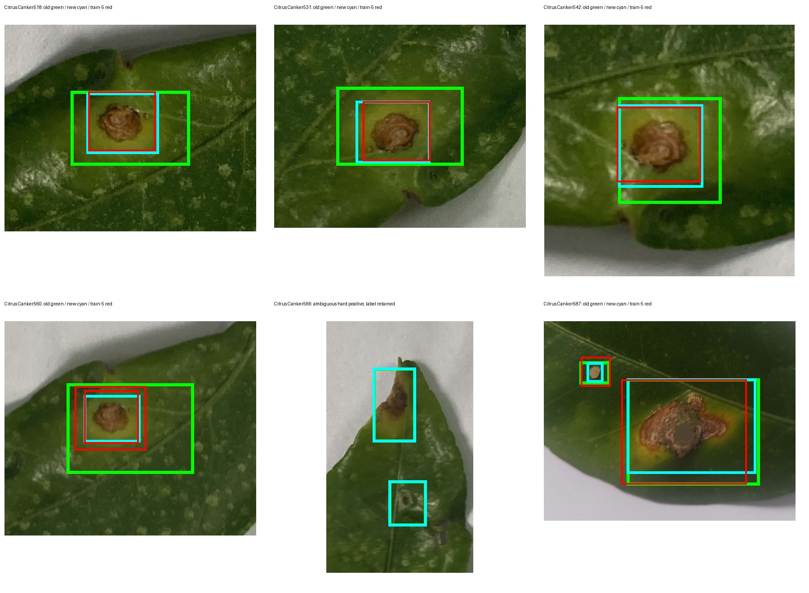
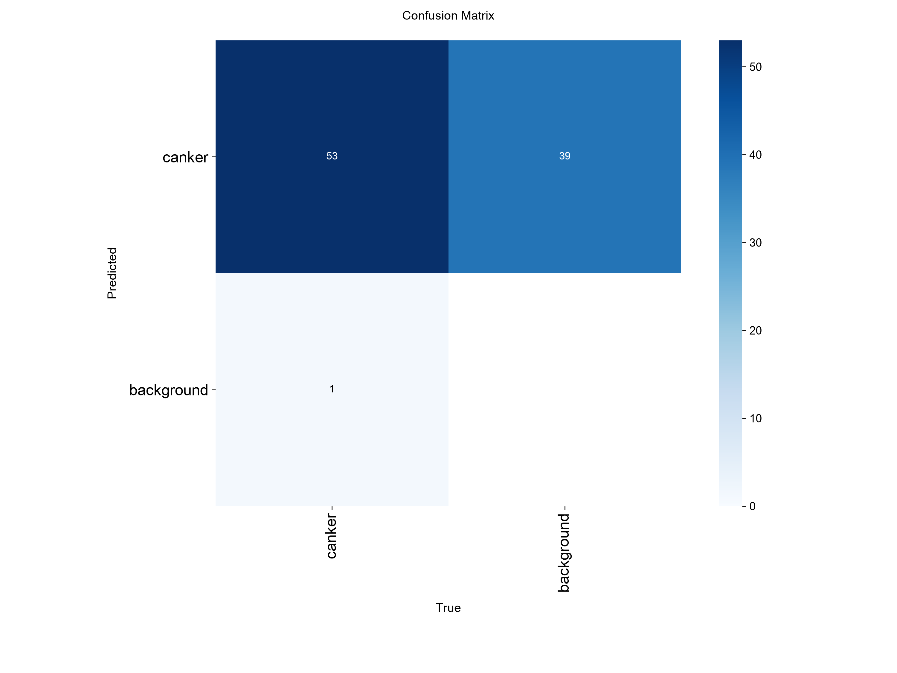

# Citrus Canker Detection with YOLO / 基于 YOLO 的柑橘溃疡病斑检测

[中文](#中文说明) | [English](#english)

## 中文说明

### 项目简介

本项目使用 Ultralytics YOLO11 检测甜橙叶片上的柑橘溃疡病斑，面向人工智能通识课算法实践。当前任务为单类别目标检测：

- 类别 `0`：`canker`（柑橘溃疡病斑）
- 基础模型：YOLO11n
- 输入：甜橙叶片图片
- 输出：病斑位置、类别与置信度

### 数据集

当前数据集包含 663 张图片和 906 个标注框：

| 集合 | 图片数 | 标注框数 | 用途 |
| --- | ---: | ---: | --- |
| train | 468 | 662 | 模型训练 |
| val | 117 | 190 | 模型选择与调参 |
| test | 78 | 54 | 阶段性诊断（已参与错误分析） |

数据不是按单张图片随机拆分，而是按物理叶片分组：同一片叶子的旋转、距离和角度变化只会出现在一个集合中，以减少数据泄漏。train 中有 52 张空标签负样本，val 中有 20 张，test 中有 27 张。train 和 val 新增负样本分别来自健康叶和 9 种其他柑橘病虫害，来源清单见 `dataset/manifests/hard_negatives_2026-09-02.csv` 与 `dataset/manifests/hard_negatives_val_2026-09-02.csv`。

数据来源于 Emon、Ahad 与 Rabbany 发布的 *Multi-format open-source sweet orange leaf dataset for disease detection, classification, and analysis*（Mendeley Data DOI：[10.17632/f7cr74mwpj.1](https://doi.org/10.17632/f7cr74mwpj.1)），原始数据采用 [CC BY 4.0](https://creativecommons.org/licenses/by/4.0/) 许可。本项目对其中部分图片进行了人工筛选、重新命名、重新标注和按叶片分组；使用或再分发时应保留原作者、数据集名称、DOI 与许可信息。

### 当前实验结果（train-5）

`train-5` 使用重新标注的数据和新增困难负样本，在第 43 轮达到最佳验证结果，并因早停在第 58 轮结束：

| 集合 | Precision | Recall | mAP50 | mAP50-95 |
| --- | ---: | ---: | ---: | ---: |
| val | 0.646 | 0.558 | 0.578 | 0.193 |
| 旧框诊断 test（640） | 0.157 | 0.241 | 0.128 | 0.048 |
| 紧框诊断 test（640） | 0.890 | 0.926 | 0.880 | 0.597 |
| 紧框诊断 test（960） | 0.838 | 0.963 | **0.919** | **0.681** |

旧 test 低分的主因是框尺度不一致。2026-09-02 复核了 51 张阳性图片，收紧其中 50 张的标签，保持 54 个框总数不变；新旧框面积比的中位数为 0.427。`Citrus Canker566` 形态存疑且未被模型检出，本次仍保留其两个旧框，没有为提分删除困难样本。

紧框 test 下，`train-4` 在 640 的 mAP50 略高（0.906 对 0.880），但 `train-5` 在 960 的召回率和 mAP50-95 明显更好，且困难负样本误报更少。当前精度优先的展示组合是 `train-5 + imgsz=960`，但 CPU 推理耗时约为 640 的 2 倍。完整重标方法、公平对照和图表见 [results/train-5-test-tight/RESULTS.md](results/train-5-test-tight/RESULTS.md)。

F1 曲线的最佳置信度约为 0.545，因此当前演示建议使用 `imgsz=960, conf=0.55`。该阈值下的逐图匹配为 52 TP、10 FP、2 FN；51 张阳性图片中检出 50 张。

上述新数值仍不是最终独立测试成绩：这组 test 已用于错误分析，重标又发生在查看预测之后。最终汇报前仍需要新建由独立物理叶片组成的 `external_test`。

#### 关键结果图

下图中绿色为旧标签，青色为复核后标签，红色为 `train-5` 预测。它直接展示了旧框过宽、新框紧贴病斑，同时保留了 `566` 这个未检出的困难样本。



| 训练曲线 | 验证集混淆矩阵 | 紧框 test 960 混淆矩阵 |
| --- | --- | --- |
|  |  |  |

PR、F1 曲线和原始 CSV 指标保存在 [`results/train-5/`](results/train-5/) 中。

### 项目结构

```text
citrus-canker-yolo/
├── dataset/
│   ├── images/{train,val,test}/
│   └── labels/{train,val,test}/
├── data.yaml
├── validate_dataset.py
├── TRAINING.md
├── DATASET_SPLIT.md
└── requirements.txt
```

训练输出、缓存和模型权重不会提交到 Git。完整拆分规则见 [DATASET_SPLIT.md](DATASET_SPLIT.md)。

### 环境安装

建议使用 Python 3.10 或更高版本：

```bash
python -m venv .venv
source .venv/bin/activate
python -m pip install -r requirements.txt
```

### 数据校验

```bash
python validate_dataset.py
```

校验脚本会检查图片与标签是否配对、类别编号、YOLO 坐标范围、空标签以及各集合数量。

### 训练

```bash
yolo detect train \
  model=yolo11n.pt \
  data=data.yaml \
  epochs=80 \
  imgsz=640 \
  batch=16 \
  patience=15 \
  cache=False \
  workers=0 \
  name=train-5
```

数据和标签改变后应从 `yolo11n.pt` 重新训练，不要使用旧实验的 `last.pt` 续训。训练结束后优先使用 `runs/detect/train-5/weights/best.pt`。

### 最终测试

```bash
yolo detect val \
  model=runs/detect/train-5/weights/best.pt \
  data=data.yaml \
  split=test \
  workers=0 \
  name=train-5-test
```

当前 test 已用于上一轮错误分析，只作为阶段性诊断集；最终汇报前应另建完全未参与调参的外部测试集。更详细的操作说明见 [TRAINING.md](TRAINING.md)。

### 当前限制

- 独立物理叶片数量仍然有限，指标只能作为阶段性结果。
- val 中已有少量其他病害负样本，但类别内物理叶片数量仍然有限。
- 拍摄背景以白色背景为主，实际果园环境下的泛化能力尚未验证。
- 后续应优先增加新的叶片、自然背景、不同光照和不同病斑阶段，而不是只增加同一片叶子的旋转图片。

## English

### Overview

This project uses Ultralytics YOLO11 to detect citrus canker lesions on sweet-orange leaves. It was developed as an algorithm practice project for a general artificial intelligence course. The current task is single-class object detection:

- Class `0`: `canker`
- Base model: YOLO11n
- Input: sweet-orange leaf images
- Output: lesion bounding boxes, class labels, and confidence scores

### Dataset

The current dataset contains 663 images and 906 annotated bounding boxes:

| Split | Images | Boxes | Purpose |
| --- | ---: | ---: | --- |
| train | 468 | 662 | Model training |
| val | 117 | 190 | Model selection and tuning |
| test | 78 | 54 | Development diagnostic; already inspected |

The dataset is grouped by physical leaf instead of being randomly split image by image. Different rotations, distances, and viewing angles of the same leaf are kept within one split to reduce data leakage. The train, val, and test splits contain 52, 20, and 27 empty-label negative images, respectively. The new train and val negatives come from healthy leaves and nine other citrus disease or pest categories. Their source manifests are stored at `dataset/manifests/hard_negatives_2026-09-02.csv` and `dataset/manifests/hard_negatives_val_2026-09-02.csv`.

The source images come from the dataset by Emon, Ahad, and Rabbany, *Multi-format open-source sweet orange leaf dataset for disease detection, classification, and analysis* (Mendeley Data DOI: [10.17632/f7cr74mwpj.1](https://doi.org/10.17632/f7cr74mwpj.1)), licensed under [CC BY 4.0](https://creativecommons.org/licenses/by/4.0/). This project manually selected, renamed, re-annotated, and grouped a subset of the images. Reuse or redistribution should preserve the authors, dataset title, DOI, and license information.

### Current Experiment Results (train-5)

`train-5` used the revised annotations and new hard negatives. It reached its best validation result at epoch 43 and stopped at epoch 58 through early stopping:

| Split | Precision | Recall | mAP50 | mAP50-95 |
| --- | ---: | ---: | ---: | ---: |
| val | 0.646 | 0.558 | 0.578 | 0.193 |
| old-box diagnostic test (640) | 0.157 | 0.241 | 0.128 | 0.048 |
| tight-box diagnostic test (640) | 0.890 | 0.926 | 0.880 | 0.597 |
| tight-box diagnostic test (960) | 0.838 | 0.963 | **0.919** | **0.681** |

The original test score was dominated by inconsistent box scale. On 2026-09-02, 51 positive images were reviewed, 50 label files were tightened, and all 54 objects were retained. The median new-to-old box-area ratio was 0.427. `Citrus Canker566` remained unchanged as an ambiguous hard positive rather than being removed to improve the metrics.

On the revised labels, `train-4` is slightly better in mAP50 at 640 (0.906 versus 0.880), while `train-5` is clearly better at 960 and produces fewer false positives on hard negatives. The current accuracy-oriented demonstration setting is `train-5 + imgsz=960`, at roughly twice the CPU inference cost of 640. See [results/train-5-test-tight/RESULTS.md](results/train-5-test-tight/RESULTS.md) for the complete re-annotation method, fair comparison, figures, and limitations.

The F1 curve peaks at approximately 0.545 confidence, so the current demonstration setting is `imgsz=960, conf=0.55`. Direct matching at this threshold gives 52 TP, 10 FP, and 2 FN, detecting 50 of 51 positive images.

These revised values are still development diagnostics rather than an unbiased final score. The split had already informed error analysis, and re-annotation occurred after predictions had been inspected. A new `external_test` made of independent physical leaves is still required for the final report.

#### Key Result Figures

Green boxes below are the old annotations, cyan boxes are the reviewed annotations, and red boxes are `train-5` predictions. The comparison shows the original scale mismatch and retains the undetected `566` hard sample.


| Training curves | Validation confusion matrix | Tight-box test confusion matrix at 960 |
| --- | --- | --- |
|  |  |  |

The PR and F1 curves and the raw CSV metrics are available in [`results/train-5/`](results/train-5/).

### Repository Structure

```text
citrus-canker-yolo/
├── dataset/
│   ├── images/{train,val,test}/
│   └── labels/{train,val,test}/
├── data.yaml
├── validate_dataset.py
├── TRAINING.md
├── DATASET_SPLIT.md
└── requirements.txt
```

Training outputs, caches, and model weights are excluded from Git. See [DATASET_SPLIT.md](DATASET_SPLIT.md) for the complete split policy.

### Installation

Python 3.10 or later is recommended:

```bash
python -m venv .venv
source .venv/bin/activate
python -m pip install -r requirements.txt
```

### Dataset Validation

```bash
python validate_dataset.py
```

The validation script checks image-label pairing, class IDs, normalized YOLO coordinates, empty labels, and split sizes.

### Training

```bash
yolo detect train \
  model=yolo11n.pt \
  data=data.yaml \
  epochs=80 \
  imgsz=640 \
  batch=16 \
  patience=15 \
  cache=False \
  workers=0 \
  name=train-5
```

After changing the data or labels, start a fresh run from `yolo11n.pt` instead of resuming an old `last.pt`. Use `runs/detect/train-5/weights/best.pt` after training.

### Final Evaluation

```bash
yolo detect val \
  model=runs/detect/train-5/weights/best.pt \
  data=data.yaml \
  split=test \
  workers=0 \
  name=train-5-test
```

The current test split has already been inspected during error analysis and is now a diagnostic split. Build a separate untouched external test set for final reporting. See [TRAINING.md](TRAINING.md) for additional guidance.

### Current Limitations

- The number of independent physical leaves is still limited, so metrics should be treated as preliminary.
- The val split now contains a small number of other-disease negatives, but the number of independent leaves per category remains limited.
- Most images use a white background; generalization to real orchard environments has not yet been validated.
- Future data collection should prioritize new leaves, natural backgrounds, varied lighting, and different disease stages rather than additional rotations of the same leaves.
