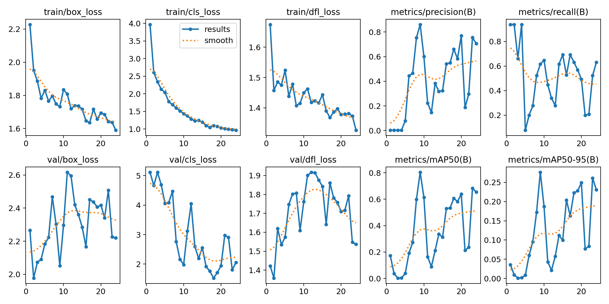
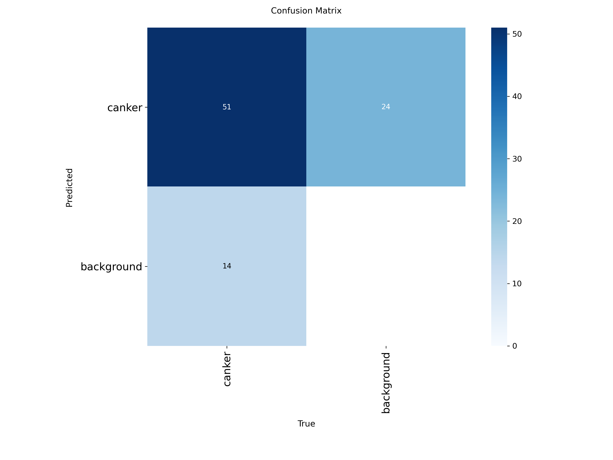
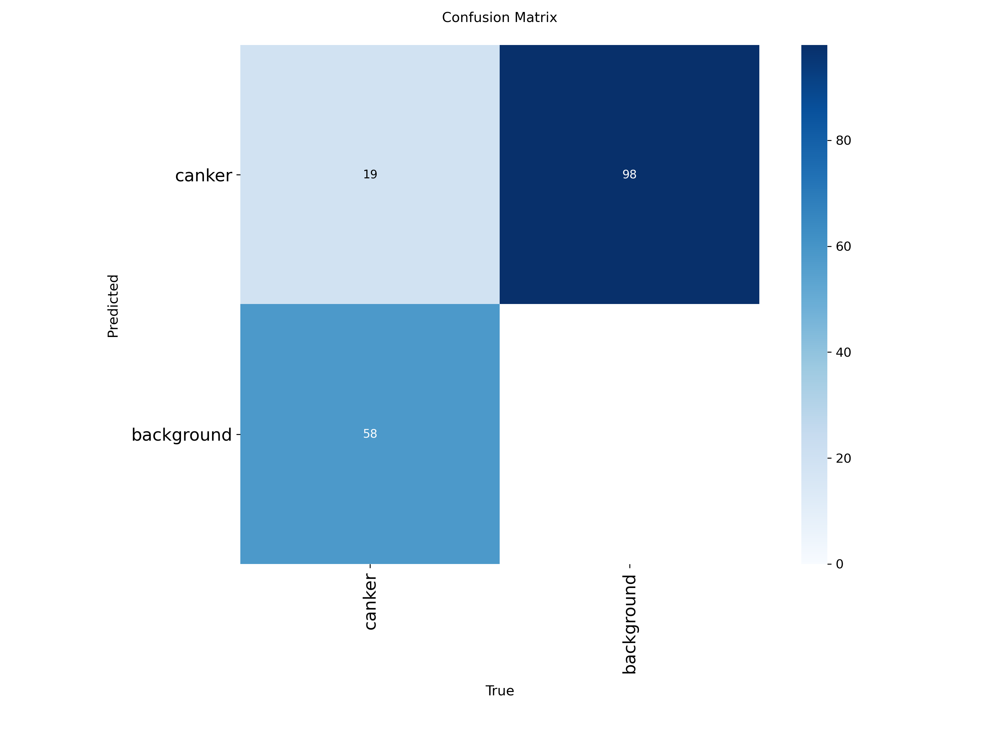
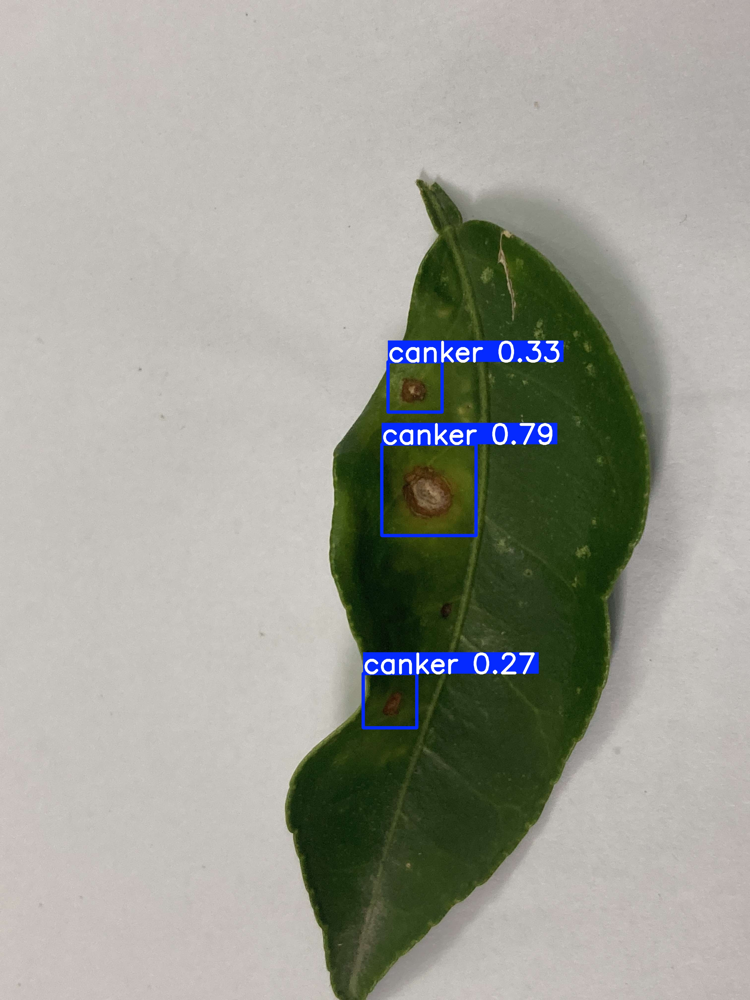
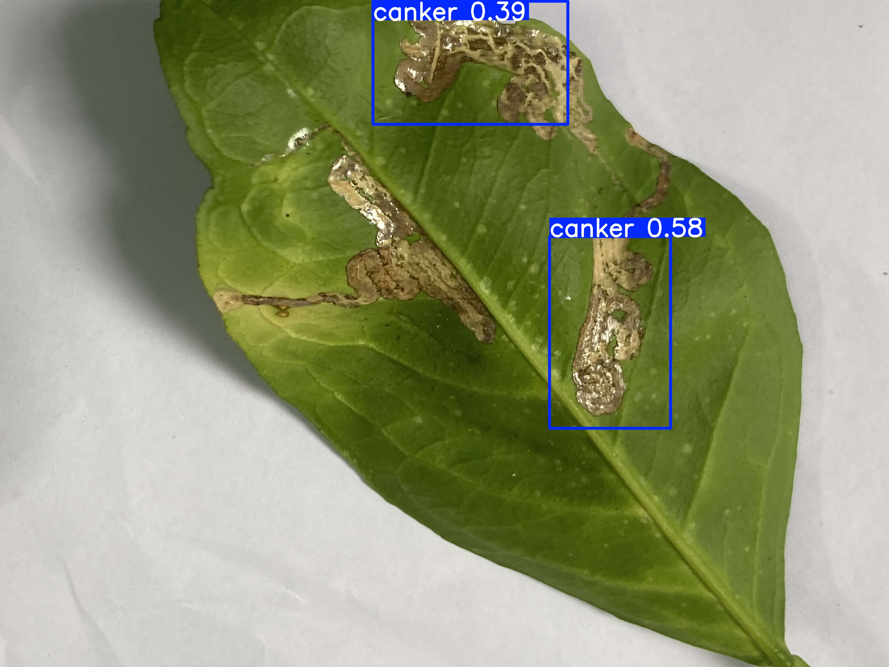
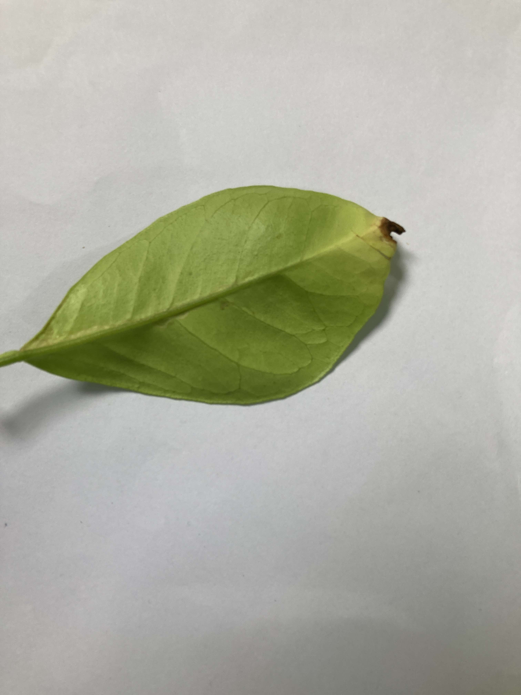

# train-3 Results / train-3 结果报告

[中文](#中文结论) | [English](#english-summary)

## 中文结论

### 一句话判断

模型已经学会识别部分病斑外观，但没有稳定泛化到新的物理叶片；同时，test 标签存在明显的漏标和病斑定义不一致风险。因此该模型适合作为第一次完整实验的基线，不适合宣称已经实现可靠的柑橘溃疡病斑检测。

### 实验配置

| 项目 | 数值 |
| --- | --- |
| 模型 | YOLO11n |
| Ultralytics | 8.3.223 |
| 图像尺寸 | 640 |
| Batch size | 16 |
| 计划轮数 | 80 |
| 实际轮数 | 24 |
| 最佳轮次 | 9 |
| Early stopping patience | 15 |
| 设备 | Apple M3 CPU |
| 训练耗时 | 约 48.4 分钟 |

第 9 轮达到最高综合验证表现，之后连续 15 轮没有超过它，因此第 24 轮自动停止。这是正常的早停，不是训练报错。最终使用的是 `best.pt`，不是 `last.pt`。

### 核心指标

| 集合 | 图片 | 标注框 | Precision | Recall | mAP50 | mAP50-95 | 最大 F1 |
| --- | ---: | ---: | ---: | ---: | ---: | ---: | ---: |
| val | 65 | 65 | 0.861 | 0.615 | 0.804 | 0.276 | 0.71（conf≈0.416） |
| test | 55 | 77 | 0.161 | 0.429 | 0.122 | 0.035 | 0.23（conf≈0.109） |

test 的 mAP50 比 val 下降约 0.682，mAP50-95 下降约 0.242。阈值从约 0.416 降到 0.109 才能取得 test 上的最高 F1，也说明模型置信度在新叶片上不稳定。

### 指标怎么看

| 指标 | 含义 | 高了说明什么 | 低了说明什么 |
| --- | --- | --- | --- |
| Precision | 所有预测框中，有多少是真病斑 | 误报少 | 容易把叶脉、反光、破损等当成病斑 |
| Recall | 所有真实病斑中，有多少被找到 | 漏检少 | 很多病斑没有被框出 |
| mAP50 | IoU≥0.5 时的综合检测表现 | 大致找到目标的能力较好 | 目标类别或位置判断不稳定 |
| mAP50-95 | 从 IoU 0.5 到 0.95 的严格平均 | 框的位置和大小更准确 | 虽然可能找到了病斑，但框不够贴合 |
| F1 | Precision 与 Recall 的平衡 | 误检与漏检比较均衡 | 至少一项明显较差 |
| train/val loss | 模型在训练集和验证集上的误差 | 两者同步下降且趋稳通常较好 | train 下降而 val 上升常提示过拟合 |

没有适用于所有项目的固定及格线。作为本课程项目的实用目标，可以先争取在“按物理叶片隔离”的 test 上达到 Precision、Recall 均超过 0.75，mAP50 超过 0.70，mAP50-95 超过 0.40，并让 val 与 test 的 mAP50 差距控制在约 0.10–0.15 内。这只是项目目标，不是通用行业标准。

### 当前结果好在哪里

- 最佳 val Precision 为 0.861，说明在与验证叶片相似的图像上，预测框中正确框的比例较高。
- val mAP50 为 0.804，说明模型已经学习到一部分病斑的颜色、形状和局部纹理。
- 训练分类损失持续下降，模型确实在学习，而不是完全没有收敛。
- `best.pt` 能在部分圆形、褐色、带晕圈的病斑上给出合理框，例如 `Citrus Canker369.jpeg` 中多个圆形病斑。

### 当前结果差在哪里

- test Precision 只有 0.161，按评估程序统计时误报非常多。
- test Recall 为 0.429，仍有超过一半的标注目标没有稳定检出。
- test mAP50-95 只有 0.035，框的位置和大小在新叶片上非常不稳定。
- train loss 总体下降，但 val box loss 和 val DFL loss 波动并一度上升；各轮 Precision、Recall 和 mAP 大幅跳动，说明数据量和叶片多样性不足。
- val mAP50=0.804，而 test 只有 0.122，不能用较高的 val 分数代表真实泛化能力。

### 混淆矩阵

在默认约 0.25 的置信度下，val 混淆矩阵记录到 51 个匹配框、14 个漏检框和 24 个未匹配预测框；test 中则为 19 个匹配框、58 个漏检框和 98 个未匹配预测框。这里的“未匹配预测框”不一定全部是模型乱框，因为 test 中存在真实病斑漏标。

### 数据与标注问题

这部分比继续增加 epochs 更重要：

1. `Citrus Canker369–396` 的图片通常能看到多个圆形病斑，但每张图片只有一个标签框。模型框出的其他真实病斑会被评估程序当作 false positive，导致 Precision 被低估。
2. `Citrus Canker67–82` 的标注集中在叶尖坏死部位，外观与典型柑橘溃疡病的隆起褐色、油渍状边缘或黄色晕圈不一致，需要重新确认是否应标为 canker。
3. `Citrus Canker127–137` 出现大面积银白色、蛇形潜道和组织破损，形态更接近潜叶蛾危害，而不是典型的离散圆形溃疡病斑。这里仅作形态学风险提示，最终标签应由可靠资料或植物病理知识复核。
4. train 中只有 2 张空标签负样本。缺少健康叶片、叶尖坏死、虫害、反光和其他病害等 hard negatives，模型很难学会“什么不是 canker”。
5. val 主要由少数外观相近的叶片组成，因此 val 指标可能偏乐观且波动很大。

下面三张图分别展示：模型在 `369` 上框出了多个圆形病斑、在 `127` 上把大面积潜道式损伤当作 canker、在 `67` 的叶尖坏死上没有给出预测。它们说明同一个 `canker` 标签当前混合了不同形态，同时又遗漏了一部分可见目标。

USDA APHIS 将典型柑橘溃疡病描述为隆起的褐色病斑，常伴油渍状边缘和黄色晕圈；UC IPM 对柑橘潜叶蛾的描述则包括叶面下的蛇形潜道、黑色虫粪线以及卷曲变形。参考：

- [USDA APHIS — Citrus Canker](https://www.aphis.usda.gov/plant-pests-diseases/citrus-diseases/citrus-canker)
- [UC IPM — Citrus Leafminer](https://ipm.ucanr.edu/home-and-landscape/citrus-leafminer/)

### 下一步

1. 先写一页标注规范：什么算一个 canker 病斑、相邻病斑是否分框、叶尖坏死和潜叶蛾是否排除。
2. 审核全部 401 张图片；目标检测必须把每张图中的全部目标都框出，不能只框一个代表病斑。
3. 增加健康叶、其他病害和非病害损伤作为负样本或困难负样本。
4. 增加新的物理叶片和自然背景，不要只增加同一片叶子的旋转图。
5. 标签修正后重新按物理叶片拆分，并另外保留一个从未参与决策的新 test 集。
6. 数据修正前不要换更大模型，也不要单纯延长训练；当前瓶颈是标签与样本，而不是模型容量。

## English Summary

### Overall Assessment

The model learned part of the lesion appearance but did not generalize reliably to new physical leaves. The test annotations also contain likely missing boxes and inconsistent lesion definitions. Therefore, `train-3` is a useful experimental baseline, not a deployment-ready citrus canker detector.

### Key Metrics

| Split | Images | Instances | Precision | Recall | mAP50 | mAP50-95 | Max F1 |
| --- | ---: | ---: | ---: | ---: | ---: | ---: | ---: |
| val | 65 | 65 | 0.861 | 0.615 | 0.804 | 0.276 | 0.71 at conf≈0.416 |
| test | 55 | 77 | 0.161 | 0.429 | 0.122 | 0.035 | 0.23 at conf≈0.109 |

The large validation-to-test gap indicates severe instability on new leaves. Training loss decreased, while validation localization losses fluctuated and sometimes increased. The model stopped at epoch 24 after its best result at epoch 9 and 15 epochs without improvement.

### Annotation Audit Findings

- Images `369–396` visibly contain multiple circular lesions, while each image has only one ground-truth box. Visually plausible detections are therefore counted as false positives.
- Images `67–82` label leaf-tip necrosis as canker, which does not match the typical raised brown lesion with water-soaked margins or a yellow halo described by USDA APHIS.
- Images `127–137` show extensive silvery, serpentine mining-like damage that resembles citrus leafminer injury described by UC IPM and requires expert review.
- Only two training images are explicit negative samples, which is insufficient for controlling false positives.

### Recommended Next Steps

Define a strict annotation protocol, audit every image, annotate every visible target, add healthy and hard-negative leaves, collect more independent physical leaves and natural backgrounds, then create a new untouched test set. More epochs or a larger YOLO model will not solve the current data problem.

### Model Artifact

The experimental `best.pt` checkpoint is distributed through the private GitHub Release tagged `train-3`. SHA-256:

`03c56a43b295e65514ab0605eb22c372c01c293d39f56f52ba92b47d9b4b3ee0`
