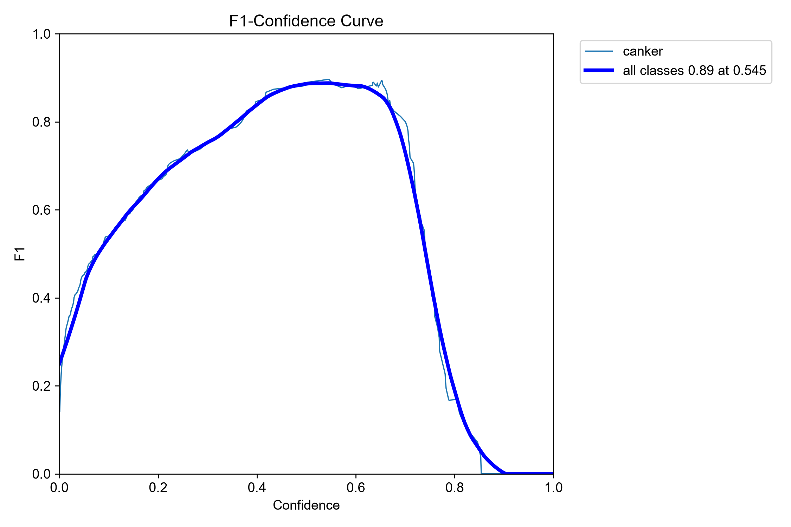
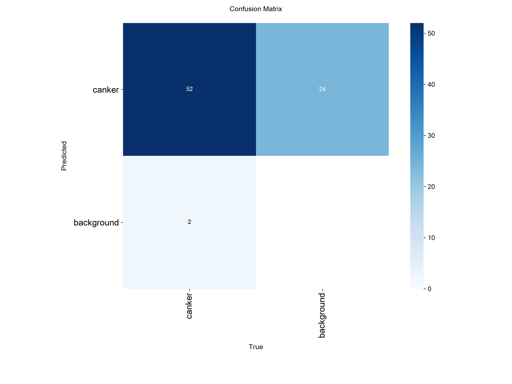
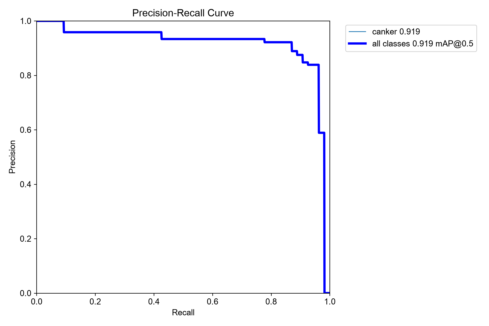

# Tight-box diagnostic test / 紧框诊断测试

[中文](#中文结论) | [English](#english-summary)

## 中文结论

### 结论

旧 test 的低分主要来自标注框明显过宽，而不是模型没有找到病斑。统一标注口径后，`train-5` 在 640 尺寸的 mAP50 从 0.128 恢复到 0.880，mAP50-95 从 0.048 恢复到 0.597；在 960 尺寸下进一步达到 0.919 和 0.681。

这些仍是阶段性诊断指标，不是最终独立测试成绩：当前 test 已经用于错误分析，而且本次重标发生在查看模型预测之后。最终报告仍需另建从未参与调参的 `external_test`。

### 标注复核

- 复核了 51 张阳性 test 图片，共 54 个框；集合成员和框数量均未改变。
- 其中 50 张图片的标签被收紧；新框面积与旧框面积之比的中位数为 0.427。
- 候选框根据旧框区域内的可见褐色坏死组织和紧邻黄晕生成，再逐图人工查看；模型预测只作为最后的质量复核，没有直接复制为标签。
- `Citrus Canker587–588` 的双病斑框单独人工调整。
- `Citrus Canker566` 的两个框形态与主体样本差异大，模型也未检出。为避免通过删困难样本抬高分数，本次保留其原标签，并把它列为待植物病理复核样本。
- 旧的 78 个 test 标签和校验值完整保存在 `dataset/label_archive/2026-09-02-before-test-tight-reannotation/`。

图中绿色为旧标签，青色为复核后的标签，红色为 `train-5` 的预测。`566` 没有红框，展示了保留的真实困难样本。

### 同一标签下的公平对照

| 模型 | imgsz | Precision | Recall | mAP50 | mAP50-95 | 推理耗时/张 |
| --- | ---: | ---: | ---: | ---: | ---: | ---: |
| train-4 | 640 | 0.890 | 0.926 | 0.906 | 0.599 | 96.5 ms |
| train-5 | 640 | 0.890 | 0.926 | 0.880 | 0.597 | 100.8 ms |
| train-4 | 960 | 0.811 | 0.870 | 0.909 | 0.522 | 202.6 ms |
| train-5 | 960 | 0.838 | 0.963 | **0.919** | **0.681** | 203.8 ms |

在 640 下，`train-4` 的 mAP50 略高，mAP50-95 与 `train-5` 基本相同；因此 `train-5` 不是全面胜过 `train-4`。不过先前的困难负样本审计显示，`train-5` 在阴性图片上的误报更少。在 960 下，`train-5` 的召回率和高 IoU 指标明显更好，是当前展示和高精度推理的首选组合。

960 的代价是推理时间约为 640 的 2 倍。课程演示若更重视准确框选，可用 `train-5 + imgsz=960`；若更重视速度，可保留 640，并把 `train-4` 作为定位基线、`train-5` 作为较少误报的版本。

### 演示阈值

`train-5 + imgsz=960` 的 F1 曲线在置信度约 0.545 时达到最高值 0.89，因此演示可用 `conf=0.55`，不建议继续使用默认的 0.25。

在 `conf=0.55`、IoU≥0.5 的逐图匹配中：

- 52 个真阳性框、10 个误报框、2 个漏检框；Precision 0.839，Recall 0.963。
- 51 张阳性图片中 50 张检出，阳性图片灵敏度为 0.980；唯一未检出的是 `Citrus Canker566`。
- 27 张阴性图片中 17 张无误报，阴性图片特异度为 0.630。误报集中在 `127–132` 和 `79–82`。

混淆矩阵使用的置信度阈值更低，因此图中显示 39 个背景误报；它不代表 `conf=0.55` 的实际演示状态。

| train-5 640 混淆矩阵 | train-5 960 混淆矩阵 |
| --- | --- |
|  |  |

### 下一步

1. 暂不继续堆训练轮数，也不立即换更大模型；当前最缺的是独立叶片，而不是模型容量。
2. 建立由新物理叶片组成的 `external_test`，覆盖溃疡、健康叶、穿孔病和叶片损伤，并在模型、分辨率和置信度固定后只评估一次。
3. 单独复核 `Citrus Canker566` 的病害身份和两个框；如果无法确认，应从“最终独立测试”中排除并注明原因，而不是根据模型结果决定。
4. 下一轮训练只做一个主变量：优先补充新的 `Shot Hole` 与 `Foliage damaged` 困难负样本；从 `yolo11n.pt` 重新训练，不能续接 `last.pt`。
5. 若仍要测试 960 训练，保持数据完全不变，另开一个实验名，与 640 训练进行单变量比较。

## English Summary

The very low original diagnostic-test score was dominated by oversized ground-truth boxes rather than failure to locate lesions. After reviewing 51 positive images and tightening 50 image-label files while preserving all 54 objects, `train-5` reached mAP50/mAP50-95 of 0.880/0.597 at 640 pixels and 0.919/0.681 at 960 pixels. The median new-to-old box-area ratio was 0.427.

These are development diagnostics, not an unbiased final test: the split had already been inspected and the re-annotation happened after model-error analysis. `Citrus Canker566` was deliberately retained as an ambiguous hard positive instead of being removed to improve the score.

On the same revised labels, `train-4` slightly outperformed `train-5` in mAP50 at 640, while `train-5` was clearly better at 960 and had previously shown fewer false positives on negative images. The best current accuracy-oriented configuration is therefore `train-5` at `imgsz=960`, with roughly twice the CPU inference time of 640.

The F1 curve peaks at approximately `conf=0.545`, so `conf=0.55` is recommended for the current demonstration. At that threshold, direct IoU≥0.5 matching gives 52 true positives, 10 false positives, and 2 false negatives; 50 of 51 positive images are detected, and 17 of 27 negative images remain free of false detections. The only missed positive image is `Citrus Canker566`. The next scientifically meaningful step is a new, untouched external test set built from independent physical leaves.
