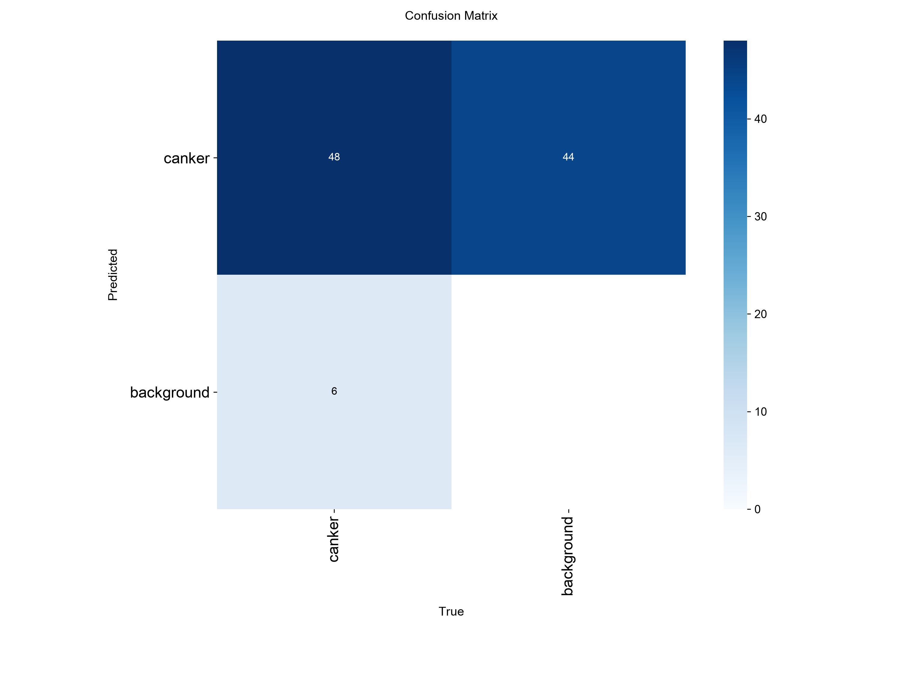
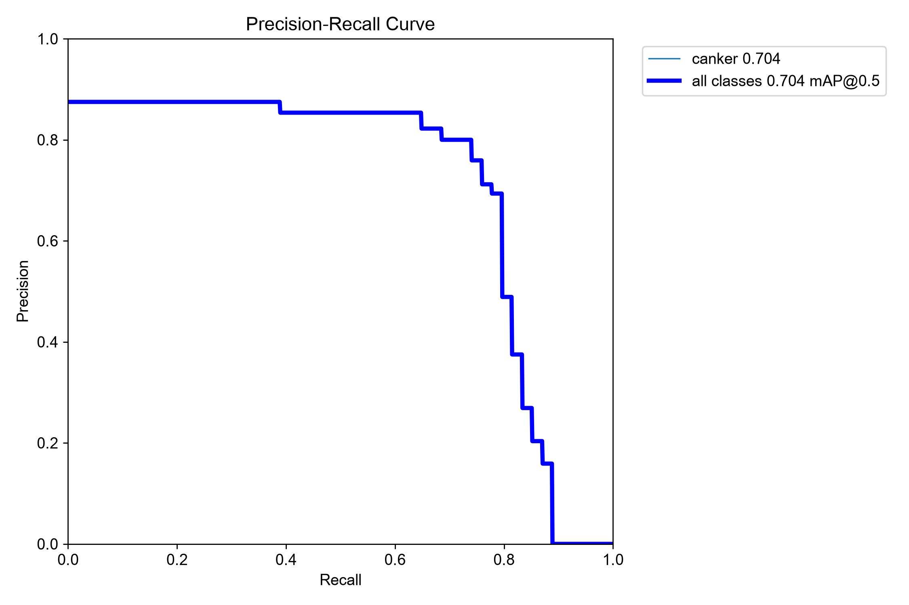

# train-5 Results / train-5 结果报告

[中文](#中文结论) | [English](#english-summary)

## 中文结论

### 一句话判断

`train-5` 已正常完成，困难负样本降低了一部分“见到异常斑块就报 canker”的问题，但当前诊断 test 的框标注尺度与新训练标签不一致，使标准检测 mAP 明显低估了模型找到病斑中心的能力。该模型仍是阶段性实验结果，暂时不能作为最终模型。

### 实验配置

| 项目 | 数值 |
| --- | --- |
| 模型 | YOLO11n |
| Ultralytics | 8.4.135 |
| 图像尺寸 | 640 |
| Batch size | 16 |
| 计划轮数 | 80 |
| 实际轮数 | 58 |
| 最佳轮次 | 43 |
| Early stopping patience | 15 |
| Workers | 0 |
| 设备 | Apple M3 CPU |
| 训练耗时 | 约 3 小时 18 分钟 |

第 43 轮同时取得最高综合 fitness、Precision、mAP50 和 mAP50-95。之后连续 15 轮没有超过它，因此在第 58 轮正常早停。后续推理应使用 `best.pt`，不是 `last.pt`。

### 核心指标

| 集合 | 图片 | 标注框 | Precision | Recall | mAP50 | mAP50-95 | 说明 |
| --- | ---: | ---: | ---: | ---: | ---: | ---: | --- |
| val | 117 | 190 | 0.646 | 0.558 | 0.578 | 0.193 | 用于模型选择 |
| 当前诊断 test | 78 | 54 | 0.157 | 0.241 | 0.128 | 0.048 | 已参与错误分析，不是最终未见测试集 |

val 指标比 train-4 高，但 train、val 的标签已经重新标注，而且 val 新增了 20 张负样本，因此不能把两轮 val 指标作为严格的单变量对照。当前 test 的标准检测指标低于 train-4，也不能简单解释为模型完全退化，原因见下方框尺度审计。

### 困难负样本是否有效

在 `conf=0.25` 的单张图片诊断下：

- val 新增的 20 张非溃疡病图片中，16 张完全没有预测框。
- 仍发生误报的 4 张为两张 `Foliage damaged` 和两张 `Shot Hole`，共出现 15 个误报框；其中 `Shot Hole145` 单张出现 10 个框，是下一轮最重要的困难负样本类型。
- 当前诊断 test 的阴性图片误报数由 train-4 的 18/27 降至 train-5 的 14/27。
- 阴性图片上的预测框总数由 35 个降至 16 个。
- 按“图片中是否出现至少一个框”计算，阴性特异度由 0.333 提高到 0.481。

因此，新增健康叶和其他病害的方向是有效的，但穿孔病和叶片损伤仍与 canker 视觉特征高度相似。

### 为什么 test mAP 反而下降

当前 test 的正样本标签没有随本轮 train/val 标签一起重新标注。抽查显示，train-5 通常在正确病斑中心给出更紧的框，而 test 人工框普遍更宽：

- 51 张正样本中有 50 张在 `conf=0.25` 下至少检测到一个框，只有 `Citrus Canker566` 没有检测框。
- 这 50 张图片的预测框中心全部位于现有人工框内部。
- 预测框面积中位数约为人工框面积中位数的 41.2%。
- 在 IoU≥0.5 的严格匹配下，匹配框由 train-4 的 27 个降至 train-5 的 13 个；大量框是“中心位置正确，但框比 ground truth 小”，因此被统计成未匹配预测和漏检。

这说明当前 test mAP 同时混合了模型误差和标注尺度误差。在统一 test 的框选标准之前，不能用 0.128 作为模型实际识别能力的唯一结论。

### 标注尺度一致性诊断（非正式指标）

为验证上述判断，2026-09-02 建立了一个不覆盖正式标签的临时副本：仅将 `Citrus Canker518–565` 的现有框围绕原中心统一缩放至宽、高的 70%，其余阳性框和全部阴性空标签保持不变，再使用同一个 `best.pt` 评估。

| 标签版本 | imgsz | Precision | Recall | mAP50 | mAP50-95 |
| --- | ---: | ---: | ---: | ---: | ---: |
| 现有诊断 test | 640 | 0.157 | 0.241 | 0.128 | 0.048 |
| 70% 框尺度临时副本 | 640 | 0.726 | 0.778 | 0.677 | 0.210 |
| 70% 框尺度临时副本 | 960 | 0.713 | 0.759 | 0.704 | 0.234 |

统一缩框后，640 尺寸的 mAP50 提高 0.549；将推理尺寸从 640 提高到 960 又带来 0.027 的 mAP50 和 0.024 的 mAP50-95 增益，但推理耗时由每张约 96 ms 增至 214 ms。由此可见，主要矛盾是标签尺度；提高分辨率只有次要增益。

这些数值不能替代正式 test 指标：70% 比例是在查看当前预测后确定的，属于诊断性敏感度分析，并非独立人工真值。它证明“统一人工标注可能显著恢复指标”，不证明模型已经达到 mAP50=0.704。

下面的对比图中绿色为 test 原标签，红色为 train-5 预测。多张图片的红框位于绿色框内部，直观展示了框尺度不一致。

### 下一步

1. 暂时不要换 YOLO11s 或继续增加 epochs；960 分辨率可作为后续单变量对照，但它不是当前主要问题。
2. 按当前新标签的“紧贴病斑”标准人工重新检查当前诊断 test 的 51 张正样本，尤其是 `518–565`，并补齐一图多病斑时的遗漏框；不要直接采用本次统一缩框结果。
3. 将 `Shot Hole` 和 `Foliage damaged` 作为重点困难负样本类型，再增加不同物理叶片，但不能把当前 val 图片移入 train。
4. 统一标签后重新评估 train-4 与 train-5；只有使用同一套 ground truth 才能判断模型是否真正提升。
5. 最终汇报前另建完全未参与调参的 `external_test`，在模型和阈值固定后一次性评估。

### 模型文件

本地最佳权重：`runs/detect/train-5/weights/best.pt`

SHA-256：

`93a16acb5717ab04fab9f0cff8a587f62e8c787d7aa0f85d7944be0a571becfc`

模型权重不进入 Git 历史，应通过 GitHub Release 单独发布。

## English Summary

### Overall Assessment

`train-5` completed normally and reduced some false positives on healthy leaves and other citrus diseases. However, the current diagnostic test annotations use substantially larger boxes than the newly revised train/val annotations. Many predictions correctly locate the lesion center but fail the IoU threshold because their boxes are tighter. The run is therefore an intermediate experiment, not a final detector.

### Key Metrics

| Split | Images | Instances | Precision | Recall | mAP50 | mAP50-95 | Role |
| --- | ---: | ---: | ---: | ---: | ---: | ---: | --- |
| val | 117 | 190 | 0.646 | 0.558 | 0.578 | 0.193 | Model selection |
| diagnostic test | 78 | 54 | 0.157 | 0.241 | 0.128 | 0.048 | Previously inspected diagnostic split |

At `conf=0.25`, 16 of the 20 newly added negative validation images produced no detections. The remaining false positives were confined to two `Foliage damaged` images and two `Shot Hole` images. On the diagnostic test, false-positive negative images decreased from 18/27 for train-4 to 14/27 for train-5, while predicted boxes on negatives decreased from 35 to 16.

Among 51 positive diagnostic-test images, 50 produced at least one prediction. Every one of those 50 images had a prediction center inside its ground-truth box, but the median predicted box area was only 41.2% of the median ground-truth area. This systematic box-size mismatch substantially depresses IoU-based mAP.

### Annotation-Scale Consistency Diagnostic (Not a Formal Test)

To test this explanation without overwriting the project labels, a temporary copy was created on 2026-09-02. Only the width and height of the existing boxes for `Citrus Canker518–565` were uniformly scaled to 70% around their original centers. All other positive boxes and all empty negative labels were unchanged, and the same `best.pt` was evaluated.

| Label version | imgsz | Precision | Recall | mAP50 | mAP50-95 |
| --- | ---: | ---: | ---: | ---: | ---: |
| Existing diagnostic test | 640 | 0.157 | 0.241 | 0.128 | 0.048 |
| Temporary 70%-scale copy | 640 | 0.726 | 0.778 | 0.677 | 0.210 |
| Temporary 70%-scale copy | 960 | 0.713 | 0.759 | 0.704 | 0.234 |

At 640 pixels, consistent box scaling increased mAP50 by 0.549. Increasing inference size from 640 to 960 added only 0.027 mAP50 and 0.024 mAP50-95, while inference time increased from approximately 96 ms to 214 ms per image. Annotation scale is therefore the dominant issue; higher resolution provides a smaller secondary gain.

These numbers must not replace the formal test metrics. The 70% factor was selected after inspecting current predictions, so this is a diagnostic sensitivity analysis rather than independent ground truth. It demonstrates that consistent manual re-annotation may recover the metrics; it does not prove that the model has achieved mAP50=0.704.

### Recommended Next Step

Manually audit and consistently re-annotate the positive diagnostic-test boxes before comparing train-4 and train-5; do not directly adopt the uniformly scaled diagnostic labels. Add more independent `Shot Hole` and `Foliage damaged` negatives, then build a new untouched external test set for final reporting. Treat 960-pixel inference only as a single-variable comparison and do not change model size, resolution, and data simultaneously.

The local `best.pt` SHA-256 is:

`93a16acb5717ab04fab9f0cff8a587f62e8c787d7aa0f85d7944be0a571becfc`

The checkpoint is excluded from Git history and should be distributed through a GitHub Release.
